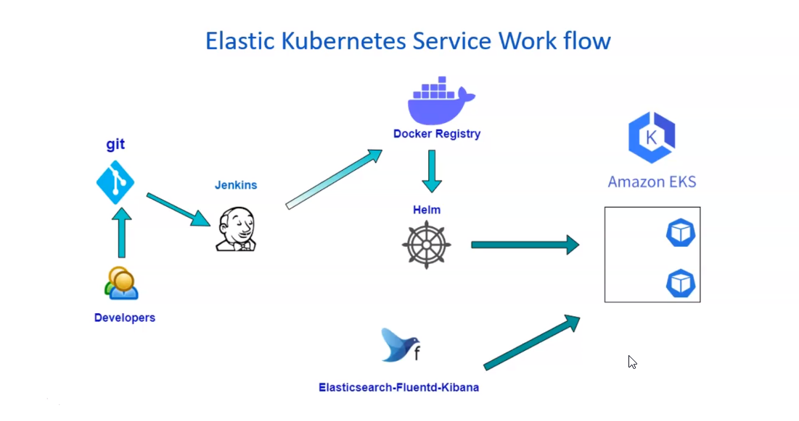

### Setup Jenkins Server for CICD in EKS Cluster

### Setup EKS clusetr in AWS

### Helm and Helm Charts

### Setup Continous Intergration Job

### Deploy Java App on EKS using Helm

### Configure Horizontal Pod Autoscaler

### EFK for application Logs